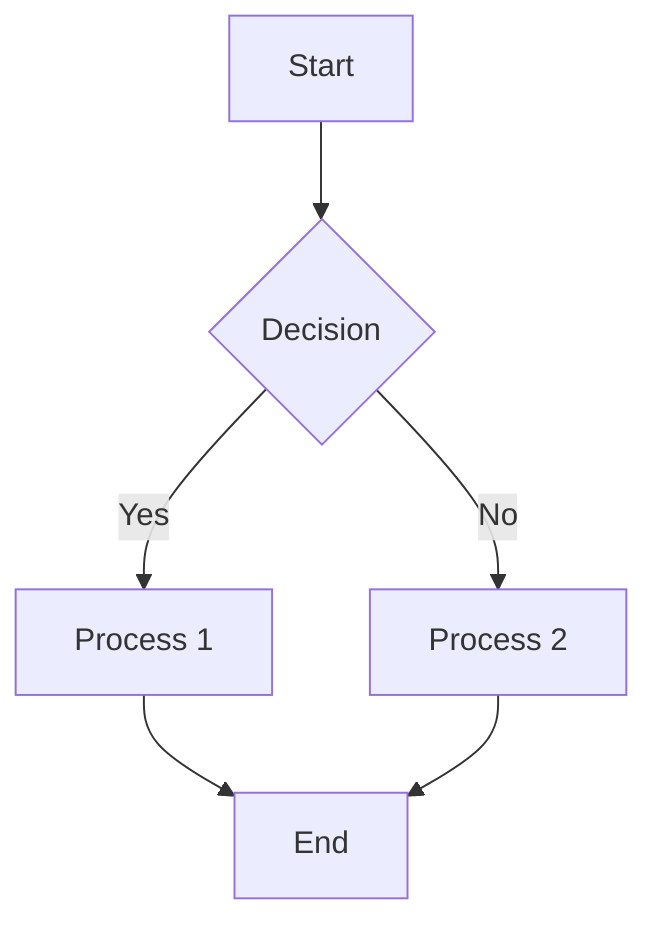
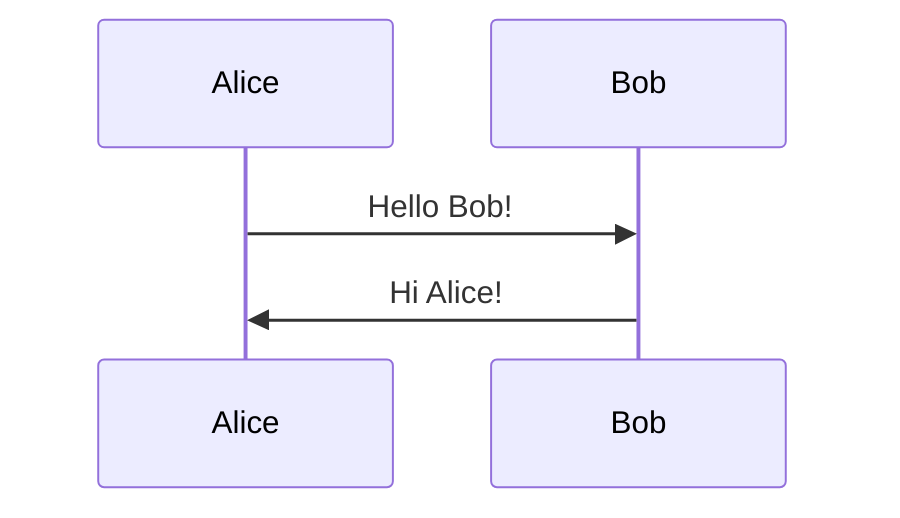

## a

日記！

$$c = \pm\sqrt{a^2 + b^2}$$

$$\LaTeX$$

## Mermaid Test

```mermaid
graph TD
    A[Start] --> B{Decision}
    B -->|Yes| C[Process 1]
    B -->|No| D[Process 2]
    C --> E[End]
    D --> E
```

```mermaid
sequenceDiagram
    participant A as Alice
    participant B as Bob
    A->>B: Hello Bob!
    B->>A: Hi Alice!
```
