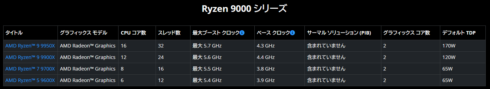
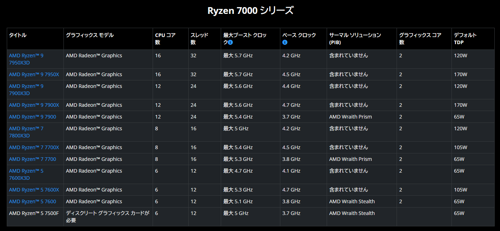

## 目的
Kubernetes を勉強しようと思ってマシンを購入した。
元から Minisforum の UM580 と呼ばれる Ryzen 7 5800H を搭載したミニ PC を持っているが、
簡単に構築しなおせるマシンとして別途欲しいなと思ったため購入した。 
Kubernetes を始めるにあたって N100 マシンを数台並べてクラスタを組むというのが事例として多そうだが、
物理的にマシンを管理するのは面倒であるため、コア数が多い物理マシンを置き、
その上に仮想マシンをいくつか作成する、という方針を考えた。

## CPU
前提として Ryzen で TDP 65W 以下を考えた。
Intel Core CPU は P Core と E Core の big.LITTLE 構成を取っており、
この構成が仮想マシンを運用する上でボトルネックになるのかどうかよく分かっていないため、
全て同じコアである Ryzen を選ぶことにした。
TDP 65W は電気の消費量を大きくしたくないのと、DeskMeet をマザーボードとして選択する上での
制約になるためである。
ミニ PC を選択しなかった理由としては使用される CPU がモバイル向けになるのと、
この場合はメモリが SO-DIMM だから将来的にデスクトップのマザーボードに転用できない。
加えてミニ PC だと CPU の換装ができない。
Deskmini はメモリが SO-DIMM であるため、同様の理由から候補から外した。
しかし、高頻度に CPU やメモリを別マシンに移植するのかと問われればそうではないし(新しく購入すると思う)、
モバイル CPU のパワーでも十分な気がするため、次はミニ PC を買う気がする。

ということで [https://www.amd.com/ja/products/processors/desktops/ryzen.html#specifications](https://www.amd.com/ja/products/processors/desktops/ryzen.html#specifications) を見る。

候補としては 9700X ないし 7900 になる。
初めは 7900 の存在に気がついておらず 9700X にしようとしていた。
下記の記事を読んで比較してみると、やはりコア数は正義のような気がする。

[AMD Ryzen 5 9600X &amp; Ryzen 7 9700X Offer Excellent Linux Performance Review - Phoronix](https://www.phoronix.com/review/ryzen-9600x-9700x)

ということで 7900 にした。

価格はドスパラで購入したためドスパラ価格で書いておく。(2024-10-16 時点)
- Ryzen 7 9700X
  - [https://www.dospara.co.jp/SBR1299/IC509913.html](https://www.dospara.co.jp/SBR1299/IC509913.html)
    - 64,800 円
- Ryzen 9 7900
  - [https://www.dospara.co.jp/SBR1299/IC484673.html](https://www.dospara.co.jp/SBR1299/IC484673.html)
    - 67,980 円 

## マシン構成
CPU 以外は特に考えていなくて、下記のような構成にした。
ストレージは余っていた M.2 があったので使いまわしている。
メモリは考えるのが面倒になってドスパラのページで適当に DDR5 の 32GB x2 を選んだ。
グリスは別途購入していたが、NH-L9a-AM5 に付属していたのでそれを利用した。

| 項目         | 製品                                                                                                        | 価格    |
| ------------ | ----------------------------------------------------------------------------------------------------------- | ------- |
| DeskMeet     | [DeskMeet X600](https://www.asrock.com/nettop/AMD/DeskMeet%20X600%20Series/index.jp.asp#Specification)      | 29,800  |
| CPU          | [Ryzen 9 7900](https://www.amd.com/ja/products/processors/desktops/ryzen/7000-series/amd-ryzen-9-7900.html) | 67,980  |
| CPU クーラー | NH-L9a-AM5                                                                                                  | 6,840   |
| メモリ       | [Crucial CP2K32G56C46U5](https://www.crucial.jp/memory/ddr5/cp2k32g56c46u5)                                 | 25,100  |
| 総額         |                                                                                                             | 129,720 |

組んだ後に気がついたが、GPU を配置する部分がスカスカになっていた。
今のところ GPU を搭載する気持ちはないので、通気性のためにファンを設置したい。

使用しているメモリが保証返品対象らしい…。
- [https://www.crucial.jp/support/articles-faq-memory/y4ca-messaging](https://www.crucial.jp/support/articles-faq-memory/y4ca-messaging)
