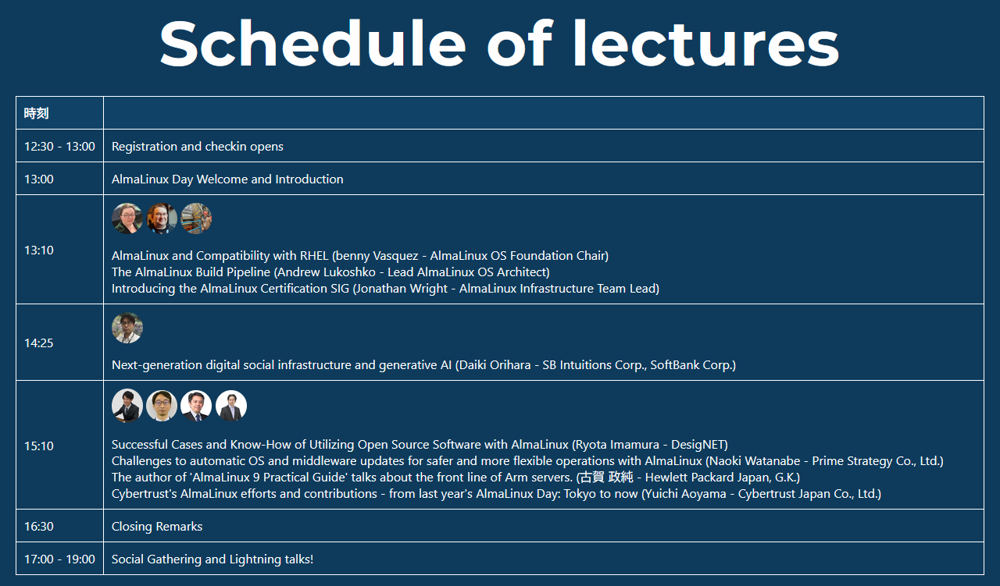
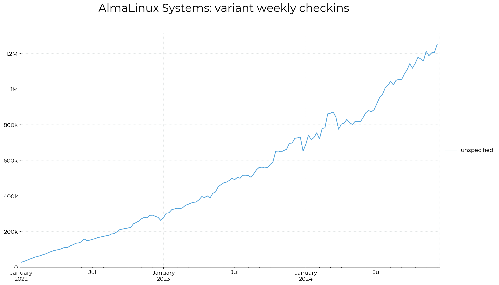
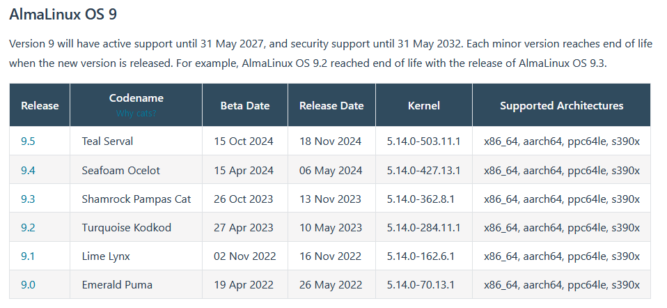
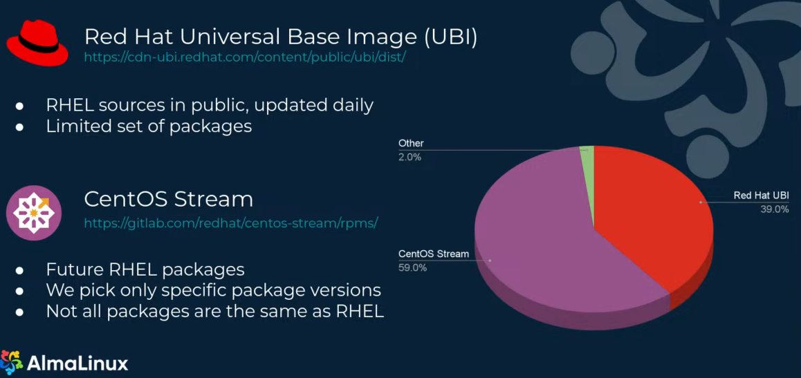

## AlmaLinux Day Tokyo
昨年は法政大学情報科学部の Advent Calendar の記事として [Almalinux Day Tokyo 2024 に参加した記事](https://gist.github.com/blank71/388f5a7cafa00b288e3e4450a97a2539)を書いた。
今年は同じ Advent Calendar を作成していなく、何か関連する Advent Calendar はないものか、と探したが私の所属に関連するものはなかった。
とりあえず同じキャンパスの Advent Calendar でも貼っておく。
- [K3 Advent Calendar 2024 - Adventar](https://adventar.org/calendars/10132)
- [法政大学理工学部 Advent Calendar 2024 - Adventar](https://adventar.org/calendars/10802)

今年も [AlmaLinux Day Tokyo 2024](https://almalinux.org/ja/aldt-2024/) に参加したため記事を書く。
卒業研究のため記事の公開までに 2 ヶ月かかってしまった。
情報としては発表時の 2024 年 12 月当時のものであることに留意されたい。

## Almalinux
AlmaLinux は RHEL 系の Linux ディストリビューションの一つである。
RHEL 系ディストリビューションは RHEL[^RHEL] と呼ばれる Red Hat 社が提供する商用の Linux ディストリビューションをベースに互換性を保ったディストリビューションである。
RHEL はサポート期間が長く、セキュリティ性が高い。
その恩恵を受けた無償ディストリビューションが AlmaLinux を始めとした RHEL 系 Linux になる。

従来は RHEL の無償版かつダウンストリームとして CentOS が使用されていたが、Red Hat の決定により CentOS はメンテナンスされなくなった。
代わりに CentOS Stream が登場してメンテナンスされることになった。
しかし CentOS Stream は Fedora のダウンストリームであり RHEL のアップストリームという立ち位置である。
RHEL のダウンストリームとして使用することはできなくなってしまった。
ということで、その立ち位置として AlmaLinux や Rocky Linux が立ち上げられたという経緯がある。

[^RHEL]: [https://ja.wikipedia.org/wiki/Red_Hat_Enterprise_Linux](https://ja.wikipedia.org/wiki/Red_Hat_Enterprise_Linux) 

## AlmaLinux Day Tokyo 2025
今年の会場は SoftBank 本社だった。会場が 30 階で海と富士山が見える良い景色だった。

スケジュールは下記のようになっていた。

## AlmaLinux and Compatibility with RHEL
AlmaLinux の [分科会](https://wiki.almalinux.org/sigs/) (Special Intrest Group) について説明があった。
これはのちのセクションで詳細について説明される。

下記の画像は AlmaLinux のパッケージ更新時にミラーを含むレポジトリにアクセスしてきたマシンの統計情報[^weeklycheckins]とのこと。
画像で示されているように規模は増大している。

AlmaLinux の RHEL に対する追従性に対して説明があった。
RHEL のリリースからおおむね 1 週間以内にリリースをしているとのこと。
過去の CentOS のリリースは RHEL にリリースから数ヶ月かかっていたのと比較して明らかに早い、と説明された。

ちなみに AlmaLinux と Rocky Linux のリリース間隔を調べてみた。いずれも AlmaLinux の方が早くリリースしている。
- https://wiki.almalinux.org/release-notes/
- https://wiki.rockylinux.org/rocky/version/

しかし、発表の中では Rocky Linux と比較した話はなく、AlmaLinux のコミュニティ志向で激しい競い合いを目的としていない色が出ているように感じた。

最後に `No drama, just Linux` ということが説明された。
過激なドラマは必要なく、安定性が重要であることが説明された。

[^weeklycheckins]: [https://jonathanspw.com/almalinux-countme/2024-12-08/2024-12-08-almalinux_baseos_systems-timeseries-line-variant.png](https://jonathanspw.com/almalinux-countme/2024-12-08/2024-12-08-almalinux_baseos_systems-timeseries-line-variant.png)

## The AlmaLinux Build Pipeline
Almalinux がビルドされるまでの道のりについて説明された。

CentOS のソースの更新は停止され、Red Hat のソースから更新を入手して AlmaLinux に転用することは Red Hat の契約に違反してしまうため使用できない。
下記のグラフにあるように現在の AlmaLinux は 40% 弱を Red Hat Universal Base Image (UBI) と呼ばれる
公開されたソースと 60% をアップストリームである CentOS Stream から取得している。

バグ修正の具体例としては bzip2 が挙げられていた。
bzip2 の開発者が AlmaLinux 8 の bzip2 の脆弱性対応によってアップストリームの bzip2 のデータ整合性テストに失敗することを AlmaLinux に通知してくれた。
11 月 12 日に通知を受けて 11 月 15 日に AlmaLinux を更新した。
そして Red Hat に対してこの問題を通達して CentOS Stream 8 と 9 に Pull Request を出した。
12 月 14 日の段階で Red Hat はこれに対して行動を起こしておらず、bzip2 のバグ修正は AlmaLinux でのみ行われていると説明があった。

regreSSHion と呼ばれる OpenSSH の脆弱性に対しても直ぐに対応できたことがアピールされた。
この脆弱性は脆弱性報告が公開されるより前に知ることができたため、脆弱性の公開同日に修正をリリースした。
Red Hat は公開の 2 日後に修正をリリースした。

AMD の脆弱性については公開された 3 日後に修正をリリースしたが、Red Hat は 2 ヶ月弱後にリリースした。

RHEL の完全なクローンを目指さないことで RHEL よりも素早くバグや脆弱性に対応していく。
加えて技術的要因なしに RHEL から削除されたデバイスドライバを引き続きサポートする。

次に AlmaLinux Kitten の紹介がされた。
AlmaLinux Kitten はローリングリリースの OS であり、CentOS Stream 10 に基づいている。
これが AlmaLinux 10 のベースになる。
CentOS Stream と RHEL からサポート外となった機能を引き続きサポートする点に違いがある[^kitten_comp]。

[^kitten_comp]: RHEL10 では Firefox が repo に含まれず Flatpak でインストールする必要がある。

AlmaLinux 10 Beta が 2024 年 12 月 10 日にリリースされた。
RHEL のソースに完全に利用可能ではない場合での初めての AlmaLinux のメジャーリリースになる。
これを元に 2025 年の 5 月に AlmaLinux 10 を正式リリースする予定である。

## Introducing the AlmaLinux Certification SIG
AlmaLinux における認定について紹介された。
認定は政府やベンダーのために必要になる。

[認定分科会](https://wiki.almalinux.org/sigs/Certification.html) はハードウェアとソフトウェアの認定に関する分科会である。

ハードウェアを始めとした一連の認定のテストを行うのは簡単で、AlmaLinux をインストールして Ansible を実行するだけで自動的に行うことができる[^Hardware-Certification-Suite]。
概ね 48 時間で完了する。
これでハードウェア、CPU ストレステスト、ビデオエンコード、仮想化などのあらゆるテストが行われる。
認定は AlmaLinux のメジャーバージョン内で有効である。

[^Hardware-Certification-Suite]: [https://github.com/AlmaLinux/Hardware-Certification-Suite](https://github.com/AlmaLinux/Hardware-Certification-Suite)

## 次世代デジタル社会基盤と生成 AI
ソフトバンク株式会社兼 SB Intuitions 株式会社の折原さんから社会基盤と AI を軸に発表があった。

これから機械学習基盤を構築する上で従来よりも電力を必要としている。
データ処理と電力消費を分散していく必要性を強調した。
分散型データセンターの最適化としてロケーションとレイテンシーを考慮していく必要がある。
超分散コンピューティング基盤 (CEF 基盤)の研究開発[^NEDO]を行っており、ゼロトラストネットワークを活用しつつ分散した計算資源をクラウドサービスとして簡単に利用可能にする。
この研究の実応用での基盤 OS として AlmaLinux を使用している。

[^NEDO]: [ポスト5G情報通信システム基盤強化研究開発事業](https://www.nedo.go.jp/activities/ZZJP_100172.html)

続いて、SB Intuitions の国産 LLM 開発への取り組みの紹介があった。
これからも AI 計算基盤を拡充していることを強調した。
また、生成 AI モデルをスクラッチで開発しており、他社の影響を受けないようにモデルを保有することが大事である。
日本語データの割合を多くすることで、より日本語に最適なモデルを作成する。
Huggingface 上に Sarashina という名前で公開されている。

## AlmaLinuxで実現するOSS活用の成功事例とノウハウ
デージーネットの今村さんからデージーネットが AlmaLinux と OSS を使って構築してきたシステムの事例について紹介された。

- HA クラスタシステム
  - Pacemeker: クラスタシステム内のリソース管理
  - Corosync: クラスタシステムを構成するノードの死活監視
- Jitsi Meet: Web 会議システム
- Zulip: チャットシステム
  - Zulip のサポート OS は Debian 系のみだが、コンテナを活用することで基盤 OS の AlmaLinux のサポート期間の恩恵を受けつつサービスを提供することができる
- Fess: 全文検索システム
- parsedmarc: DMARC のレポート解析ツール

## AlmaLinuxでの運用をより安全に。柔軟に。OS、ミドルウェアの自動アップデートへの挑戦
プライム・ストラテジーの渡辺さんから AlmaLinux をベースにした CMS や Web システムを高速かつ安全に動作させるための OS である KUSANAGI について紹介された。

安定したベース OS として AlmaLinux を活用している。
元は CentOS を利用していたが、プロジェクトが終了してしまったため CentOS Stream に移行したが、より安定した基盤として AlmaLinux に移行した。
もう一つの選択肢として Rocky Linux があるが、AlmaLinux の方がエンタープライズ向けであり、互換性を考慮しつつ、よりセキュリティに配慮しているため AlmaLinux を選択した。

昨今のセキュリティ対策によるコストの増大とリソースの逼迫の問題があり、自動的なアップロードを行う必要性がある。
これが行えるように KUSANAGI を開発中である。

## 『AlmaLinux 9実践ガイド』著者が語るArmサーバー最前線
日本ヒューレット・パッカードの古賀さんから HPE の Arm サーバーについて紹介があった。

Arm サーバーを利用すると従来よりもコア数を増やすことができ、かつ省電力にすることができることで効率的にサービスを提供することができる。
HPE が販売している 1U の RL300 Gen11 を使用すると従来は 3 ラック使用していたところを 2 ラックに削減することができる。

AI 専用サーバーとして DL384 Gen12 についても紹介があった。
これは 2U で GPU を搭載することができ、かつ CPU を 2 つ搭載でき、CPU と GPU を高速なインターフェイスで接続することでより高速な計算を可能にする。

## サイバートラストのAlmaLinuxへの取り組みと貢献活動
AlmaLinux のスポンサーであるサイバートラストの青山さんから AlmaLinux への貢献活動の紹介があった。

サイバートラストからは 2 人のフルタイムエンジニアと複数のコミュニティ貢献者を擁してる。
ボードメンバーと 2 つの SIG メンバーが在籍している。
Build System SIG と Certification SIG からそれぞれ 2 名ずつ参加している。
積極的に参加している分野として AlmaLinux ビルドシステムの改善、SBOM 関連、Raspberry Pi のサポート、ハードウェアとソフトウェアの動作認証などが挙げられる。

SBOM はソフトウェアサプライチェーンの透明性を確保するための部品表になっている。
これを用いることでライセンスやメンテナンス状況を把握することができる。
サイバートラストとしては AlmaLinux で SBOM を自動生成する際の問題を解決した。
Certification SIG としてはエフサステクノロジーズと協業して PRIMERGY のサポートを提供する。
