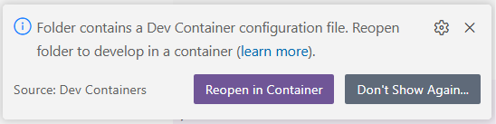
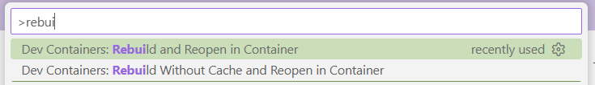
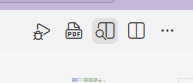
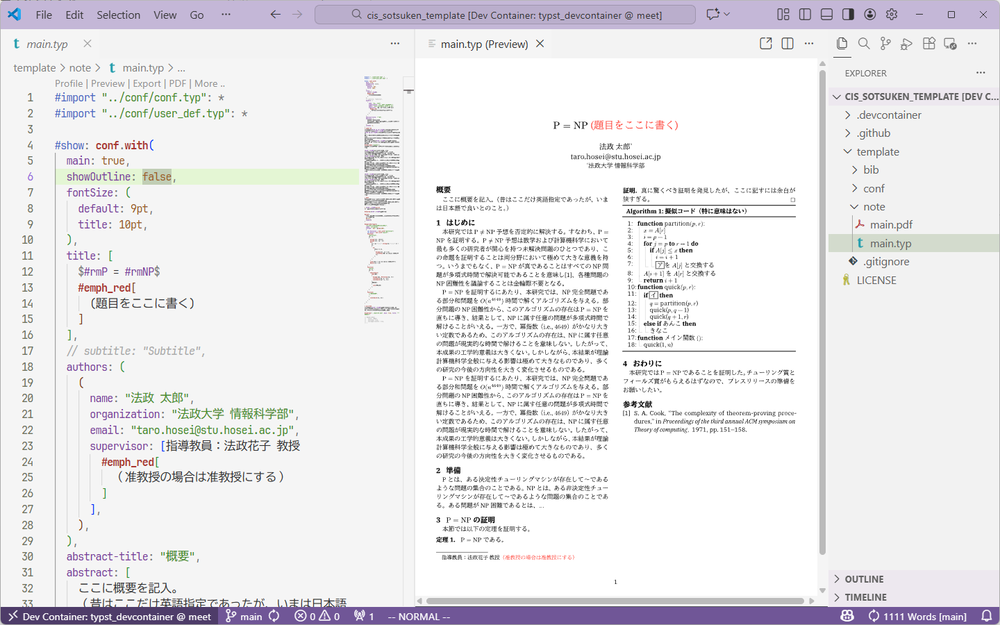

> [!NOTE]
> この記事は [Typst Advent Calendar 2025](https://qiita.com/advent-calendar/2025/typst) の 2 日目の記事です。
> 
> 1 日目の記事は [Typst の日本語スペース問題を解決する](https://zenn.dev/akamimi/articles/04d28e2f4fd602) でした。
> 和文と欧文の扱いについて困っていたので、非常に助かりました。

日頃から Typst を用いて文書を作成している。
Typst は LaTeX のような組版システムであり、高速である。
vscode の拡張機能を用いるとリアルタイムプレビューを行いながら文書が作成できる。
今回は、学部の卒論テンプレートを内包した vscode 上で動作する Typst 環境を作成した。 
これによって簡単に Typst を試すことができる。

## 環境構築手順
下記の手順に従って環境構築を行う。
- vscode をインストール
- Docker をインストール
- [Dev Containers](https://marketplace.visualstudio.com/items?itemName=ms-vscode-remote.remote-containers) を vscode にインストール
- Typst 卒論テンプレートリポジトリを clone
```console
$ git clone https://github.com/blank71/cis_sotsuken_template.git
```
- vscode で clone したディレクトリを開く
- Dev Container で該当のレポジトリを開く
  - vscode でディレクトリを開くと、下記のようなポップアップが表示されるので「Reopen in Container」を選択

    {.center}

  - あるいは、コマンドパレットから `Dev Containers: Reopen in Container` を実行

    {.center}
  - ネットワークと計算機のスペックによっては時間がかかる場合がある
- `template/note/main.typ` を開いて「Preview」ボタンを選択 

  {.center}

  - 下記のようにプレビューが表示される (初回実行時は少し時間がかかる場合がある)

    {.center}

## 参考卒論テンプレート
参考にした卒論テンプレートは [法政大学情報科学部・研究科 卒業・修了研究 抄録テンプレート](https://cis.k.hosei.ac.jp/sotsuken/template/) に掲載されている。

## ファイル構成
Typst 卒論テンプレートリポジトリのファイル構成は下記の通りである。
```console
% tree template
template
├── bib
│   └── ref.bib       // 引用文献
├── conf
│   ├── conf.typ      // 設定ファイル
│   └── user_def.typ  // ユーザー定義関数
└── note
    ├── main.pdf
    └── main.typ      // 本文

3 directories, 5 files
```

### 本文ファイル
本文ファイル `note/main.typ` は Typst のメインファイルであり、本文の内容が記述されている。

下記で設定ファイルとユーザー定義関数をインポートしている。
```text
#import "../conf/conf.typ": *
#import "../conf/user_def.typ": *
```

下記で設定を行っている。
この記述に従って設定ファイルの `conf/conf.typ` の内容が適用される。
タイトル、筆者、概要、目次の表示の有無等などを設定することができる。
```text
#show: conf.with(
  main: true,
  showOutline: false,
  fontSize: (
    default: 9pt,
    title: 10pt,
  ),
  title: [
    $#rmP = #rmNP$
    #emph_red[
      (題目をここに書く)
    ]
  ],
  // subtitle: "Subtitle",
  authors: (
    (
      name: "法政 太郎",
      organization: "法政大学 情報科学部",
      email: "taro.hosei@stu.hosei.ac.jp",
      supervisor: [指導教員：法政花子 教授
        #emph_red[
          （准教授の場合は准教授にする）
        ]
      ],
    ),
  ),
  abstract-title: "概要",
  abstract: [
    ここに概要を記入。
    （昔はここだけ英語指定であったが、いまは日本語で良いとのこと。）
  ],
  columns: 2,
)
```

## 雑記
組版ソフトウェアは初学者にとって敷居が高い。
それは執筆時に複雑な環境構築が必要になる、書きたい内容を書くために様々な調査が必要になる、などの理由がある。
この Typst テンプレートを用いることで簡単に Typst を試すことができる上、執筆に際して参考になる基本的な記述を内包している。
0 からテンプレートを記述する必要がない。
環境作成の面では、フォントの設定は初学者にとって困難な場合があるが、Dev Container を用いることで初めからフォントを内包するようにしている。
