
2 泊 3 日で伊豆大島に旅行に行ってきた。

研究部屋の人たちが計画してくれて、旅行計画も予約も全て勝手にやってくれて神すぎた。
自動車免許を持っておらず何もやらないのは申し訳なかったので、旅の栞を作成すると共に事前情報を集めるなどしていた。
栞は簡単のために Google Document を使用したかったが、Google Map の埋め込みを自由に使用したかったため Google Site を使用することにした。
ページ読み込み時にネットワーク環境が不安定なことが多いのもあって Google Map の展開に時間がかかることが多かったため、リンクだけにする方が良かったかもしれない。

<figure>
  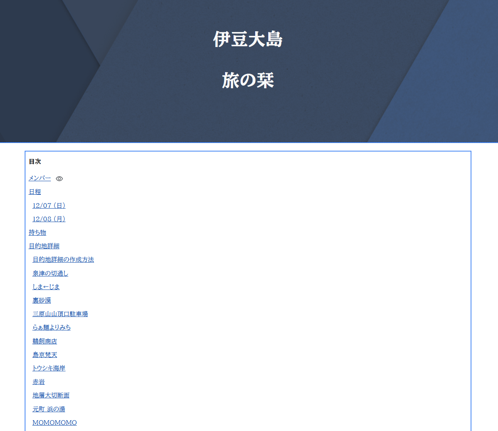
  <figcaption>google site で作成した伊豆大島 旅の栞</figcaption>
</figure>

東海汽船の宿泊プランを利用した。
1 泊目は船の上、2 泊目は大島温泉ホテルに宿泊した。
船はさるびあ丸と呼ばれる大型船で揺れは少なかった。
部屋が 2 等和室で雑魚寝スタイルで枕のみ用意されている。
船尾のエンジンに近い場所だったためエンジンの振動が直接頭に伝わてくるため、安眠はできなかった。
帰るときは 1 階上の 2 等和室だったため、比較して静かで安眠することができた。
Starlink が搭載されており、かろうじて息ができるくらいの速度は出ていた。
しかし船内全域で利用できず、部屋には届かなかった。

<figure>
  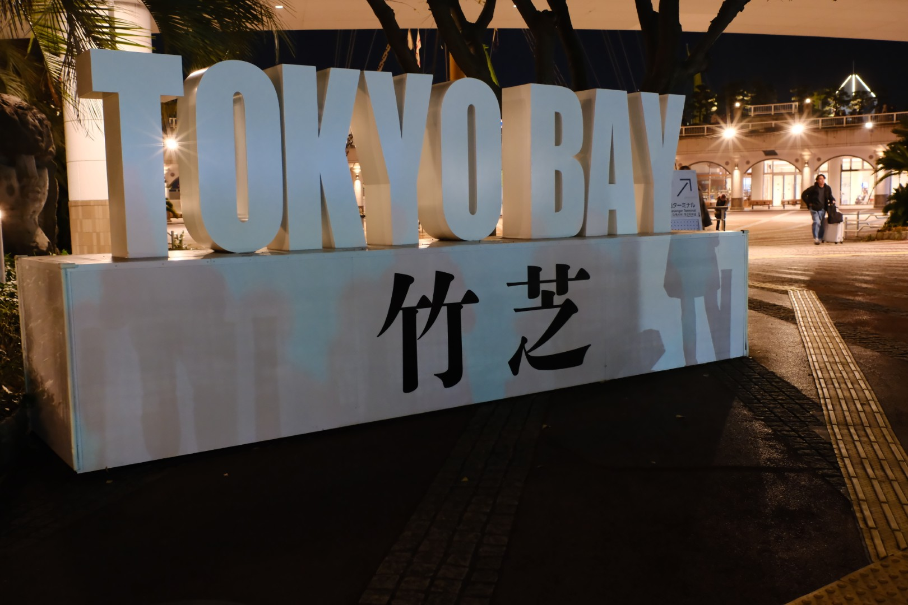
  <figcaption>竹芝客船ターミナル</figcaption>
</figure>
<figure>
  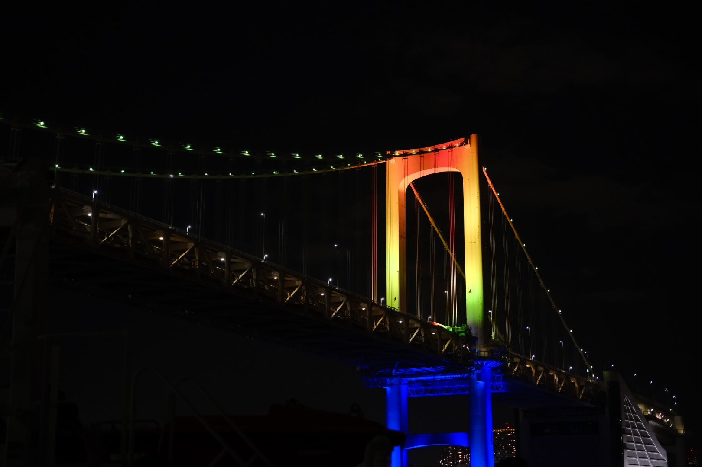
  <figcaption>レインボーブリッジ</figcaption>
</figure>
<figure>
  <a href="https://maps.app.goo.gl/4LTxgKnN6i52Dxca6" target="_blank" rel="noopener noreferrer">
    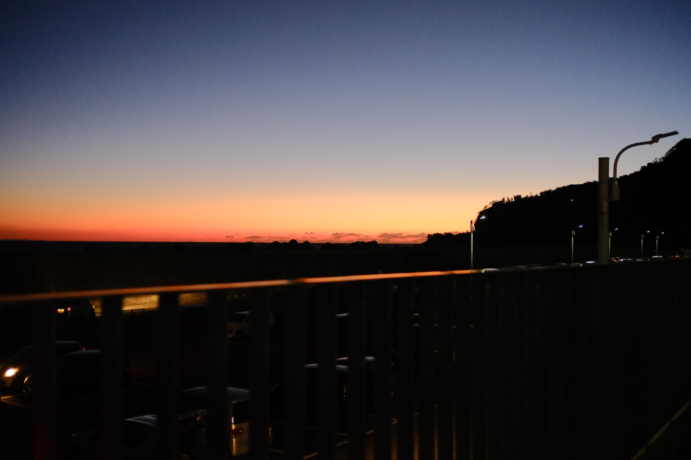
  </a>
  <figcaption>7 時に伊豆大島に到着</figcaption>
</figure>

1 日目は天気もよく、空気が綺麗だったため泉津の切通しの途中の道で富士山を臨むことができた。

<figure>
  <a href="https://maps.app.goo.gl/KSVSzTsLPaXDveSu8" target="_blank" rel="noopener noreferrer">
  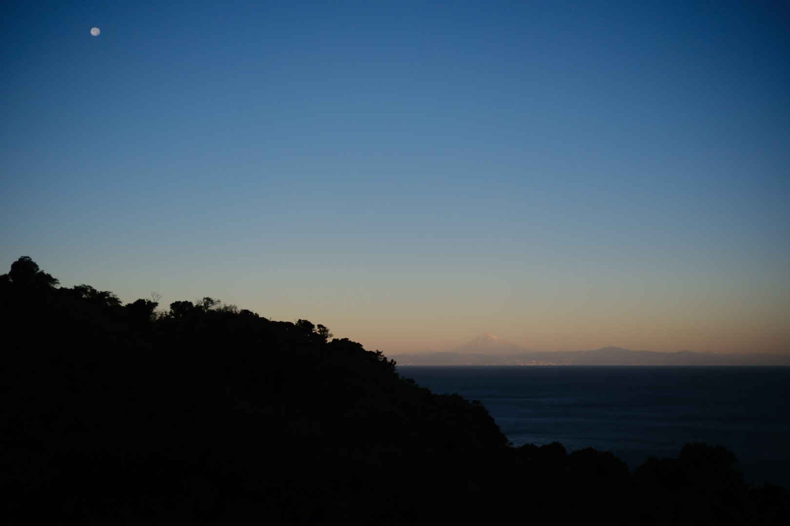
  </a>
  <figcaption>富士山</figcaption>
</figure>

しま←じま[^1] というパン屋さんで朝食を購入した。
開店の 7 時半には人が 3 組くらい並んでいた。
幸い先頭のため満足に選ぶことができた。
おそらく直ぐに完売してしまうことから早めに行くほうが良い。
出来立てのパンがパリモチで食感が良く、美味しかった。
船内ではあまり食事をしていないため皆 2、3 個ずつ購入していた。

[^1]: [伊豆大島のパン屋 しま←じま - しま←じま（シマジマ）](https://cimajima.jimdofree.com/), [しま←じま｜のえのとっておき島ごはん｜伊豆大島ナビ](https://oshima-navi.com/noe_gohan/article05.html), [しま←じま - 伊豆大島/パン | 食べログ](https://tabelog.com/tokyo/A1331/A133101/13258845/)

<figure>
  
  <figcaption>しま←じま のパン</figcaption>
</figure>

裏砂漠 [^2] は日本唯一の砂漠であり、砂丘が広がっている。
噴火によってできた土地であるから黒く鋭利な岩が多い。
歩くのが困難なほど風が強く、植物が育たないのも納得である。
斜面は急で、滑りやすいためが意が必要。
メガネが吹き飛ばないように風に対して向かうようにしてカニ歩きする必要がある。

[^2]: [日本唯一の砂漠『裏砂漠』｜伊豆大島ナビ](https://oshima-navi.com/urasabaku/)

<figure>
  <a href="https://maps.app.goo.gl/ac5a3b32jyBHBi3R8" target="_blank" rel="noopener noreferrer">
  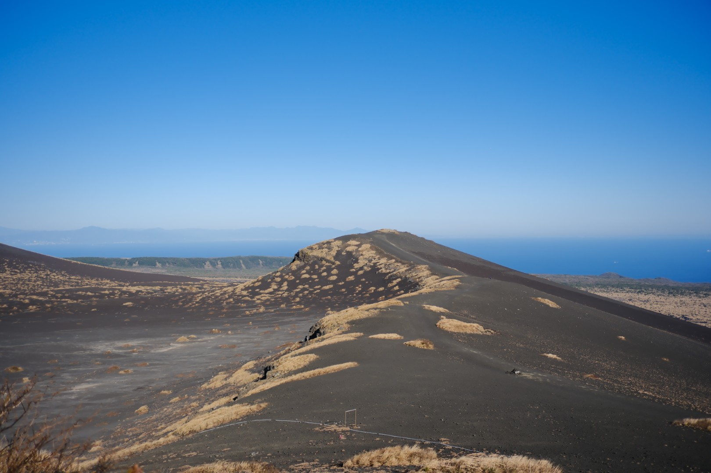
  </a>
  <figcaption>裏砂漠 第 1 展望台 付近</figcaption>
</figure>

次は表砂漠こと三原山 [^3] に行った。
下記に分かるように溶岩流が明らかだ。
右の円盤状の建物は展望台兼トイレである。
裏砂漠とは違い山頂まで道が舗装されており歩きやすく雑談しながら登ることができた。
緑も多く対照的である。
錯覚かもしれないが、裏砂漠の石は軽石のようだったが、三原山の溶岩流の石は重たく感じられた。
一見すると同じように鋭利な気泡混じりだが、実際に持ってみると違うようだった。

[^3]: [三原山トレッキング｜伊豆大島ジオパーク｜伊豆大島ナビ](https://oshima-navi.com/geopark/mihara_trek.html)

<figure>
  <a href="https://maps.app.goo.gl/mi4duRntce5H6Ebm6" target="_blank" rel="noopener noreferrer">
  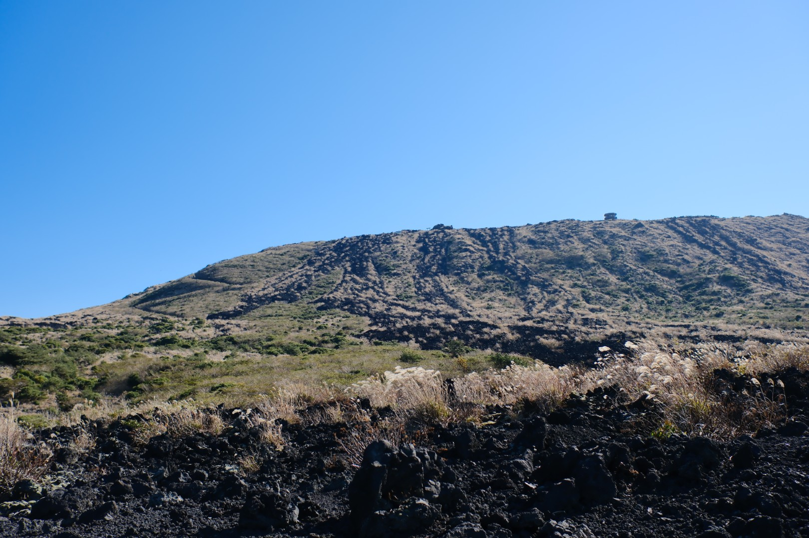
  </a>
  <figcaption>三原山 溶岩流</figcaption>
</figure>

昼食は島の南へ移動し らぁ麺よりみち [^4] で島海苔ラーメンを食べた。
貝出汁に島海苔がトッピングされている。
あっさりしたスープと島海苔の独特の食感と風味が絶妙だった。
油そばも気になった…。
こちらも人気であるため並ぶ必要があるかもしれない。

[^4]: [らぁ麺よりみち 伊豆大島](https://ramen-yorimichi.com/), [らぁ麺 よりみち 伊豆大島 - 伊豆大島/ラーメン | 食べログ](https://tabelog.com/tokyo/A1331/A133101/13240028/)

<figure>
  <a href="https://maps.app.goo.gl/npCTa8tPrVRf35C96" target="_blank" rel="noopener noreferrer">
  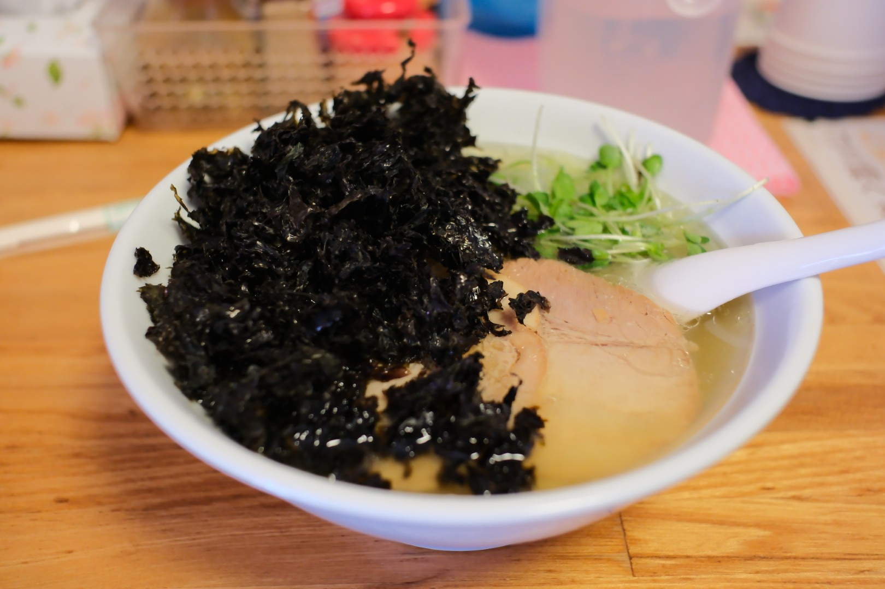
  </a>
  <figcaption>らぁ麺よりみち 島海苔ラーメン</figcaption>
</figure>

直ぐ近くには 波浮港 があり、穏やかな波を感じることができた。
おしゃれな商店もあり、昔の面影を感じることができた。
鵜飼商店と呼ばれるコロッケ店が美味しいと、広場でしま←じまのパンを食べているときに現地の人に教えてもらったが時間の都合で断念した。

<figure>
  <a href="https://maps.app.goo.gl/LGe4FfRD1cBA97SE6" target="_blank" rel="noopener noreferrer">
  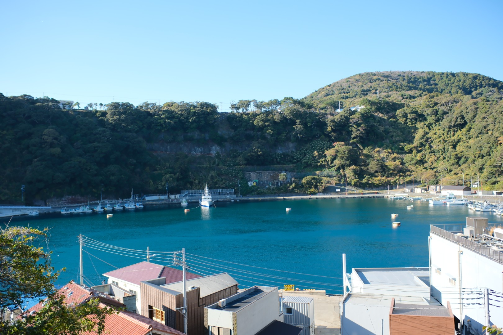
  </a>
  <figcaption>波浮港</figcaption>
</figure>

車で島の西に移動し、赤岩を鑑賞した。
赤岩近くまで車で移動することができるが、一本道で道幅が狭くて整備されていないため注意が必要だ。
岩が鋭利なため気をつけないとコケたりして手と足を切ってしまう。

<figure>
  <a href="https://maps.app.goo.gl/Jv16uKcM7kCREkEN7" target="_blank" rel="noopener noreferrer">
  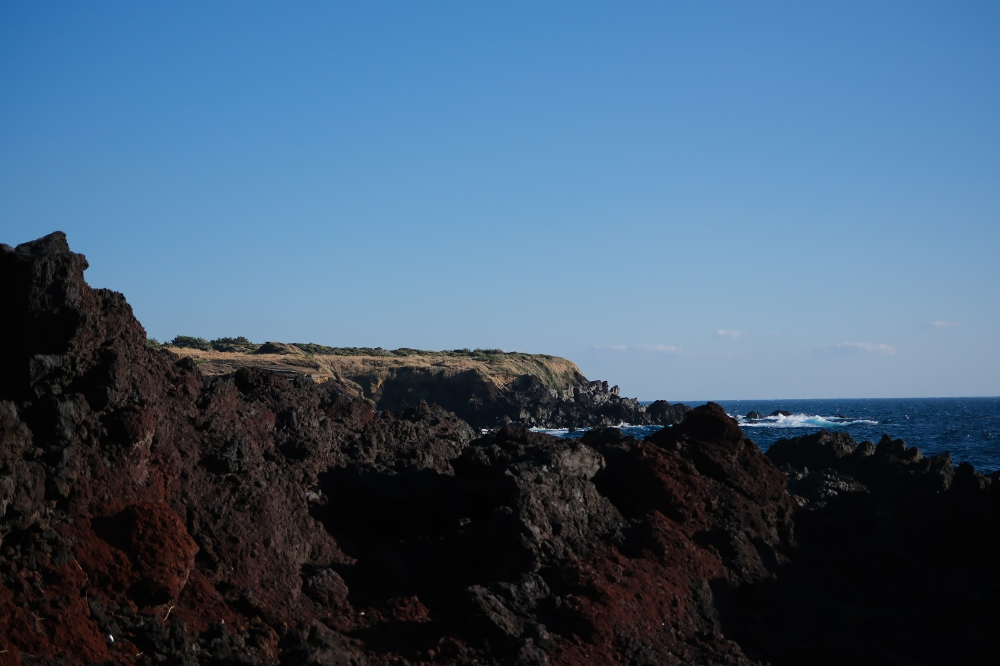
  </a>
  <figcaption>赤岩</figcaption>
</figure>
<figure>
  <a href="https://maps.app.goo.gl/Jv16uKcM7kCREkEN7" target="_blank" rel="noopener noreferrer">
  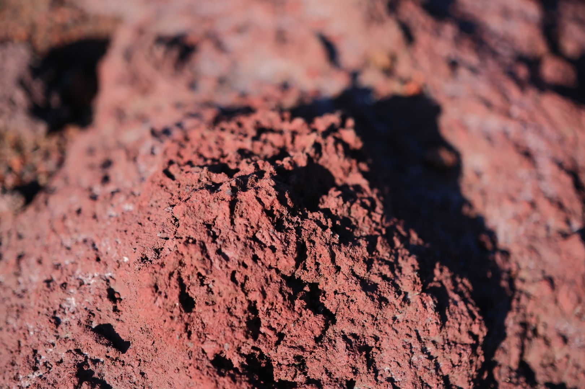
  </a>
  <figcaption>至近距離の赤岩</figcaption>
</figure>

時計回りに車で北上していくと目の前に地層大切断面が現れる。
巨大な隆起だ。
600m に渡って壮大なバームクーヘンが続く。

<figure>
  <a href="https://maps.app.goo.gl/iHjtoQmUXmaQTyD96" target="_blank" rel="noopener noreferrer">
  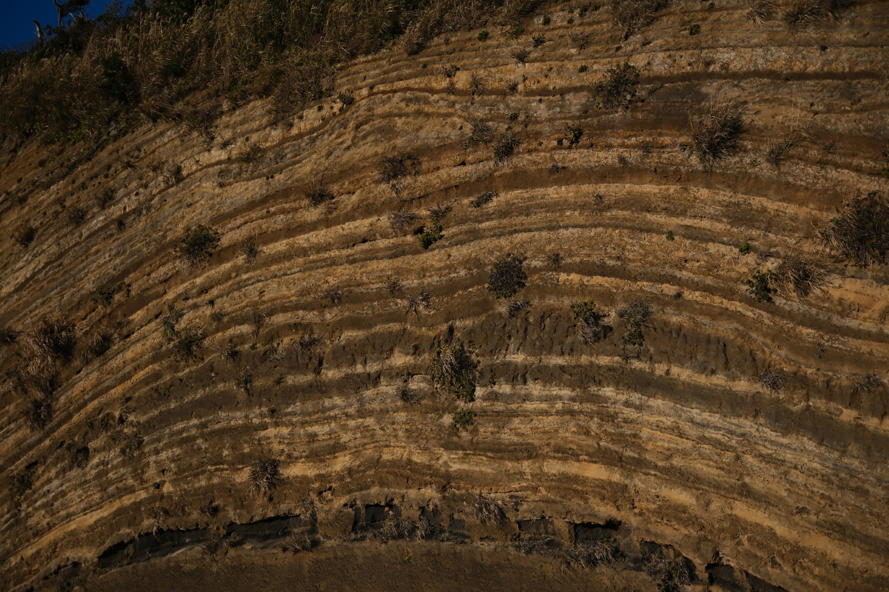
  </a>
  <figcaption>地層大切断面</figcaption>
</figure>

元町 浜の湯で日の入りまでゆったりと露天風呂を楽しむ。
足元が危うい旅路だったのでここで疲れを癒やす。
浜の湯は混浴のため水着の着用が必須である。
水着は無料で貸し出してくれるが、タオルは別途料金がかかる。

大島温泉ホテルでは卓球と将棋を楽しんだ後に夕食となった。
食後は星を撮影した。
カメラで星を撮影する術を知らなかったが見様見真似で撮影した。
一応三脚を購入しており、活用できてよかった。
寒い中で撮影したため直ぐに電池残量が減ってしまった。
モバイルバッテリーで充電しながら撮影した方が安心かもしれない。

<figure>
  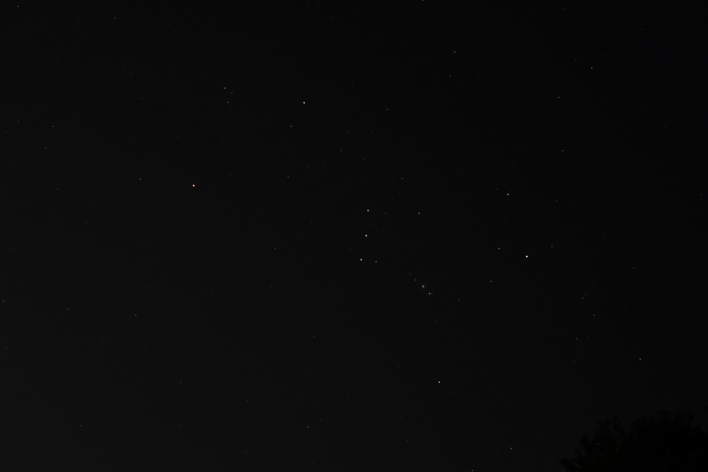
  <figcaption>オリオン座</figcaption>
</figure>
<figure>
  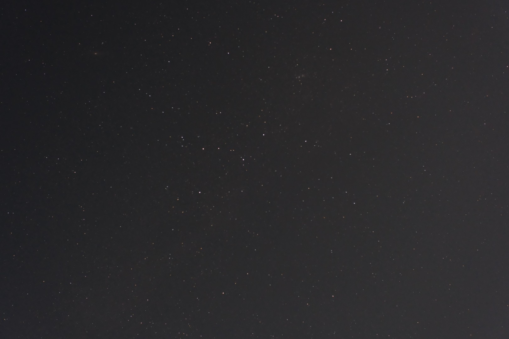
  <figcaption>カシオペア座</figcaption>
</figure>

再度、露天風呂に入り雑談をした。
その後は UNO を楽しみながら晩酌をした。
御当地のお酒として「御神火」の麦焼酎を飲んだ (写真がない…)。
ストレートでもさっぱりとしており飲みやすい。
水で割ると更に飲みやすい。

<figure>
  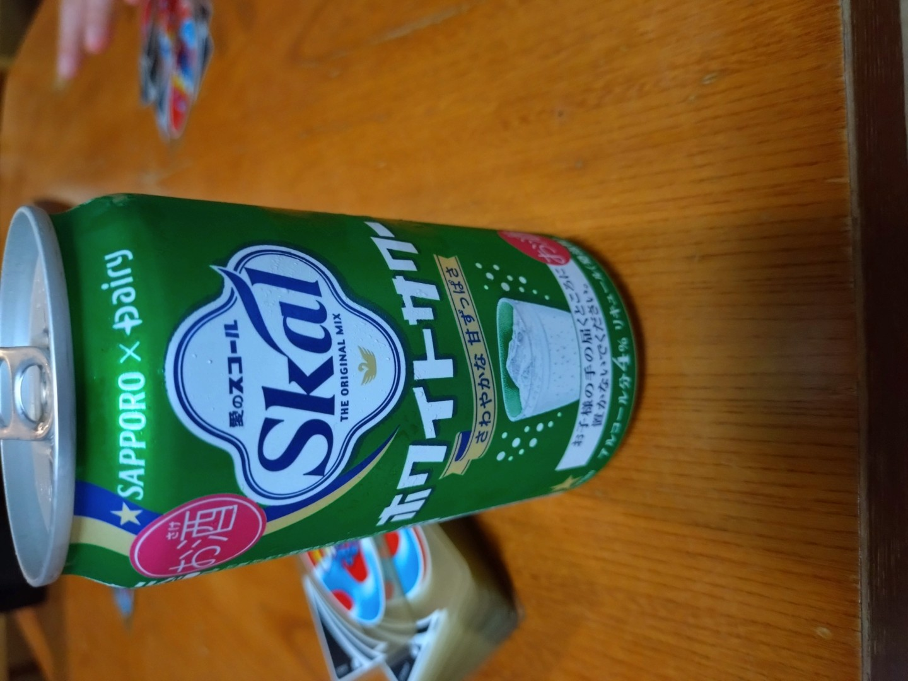
  <figcaption>スコールのサワー</figcaption>
</figure>

翌朝も天気はよく、三原山を臨むことができた。

<figure>
  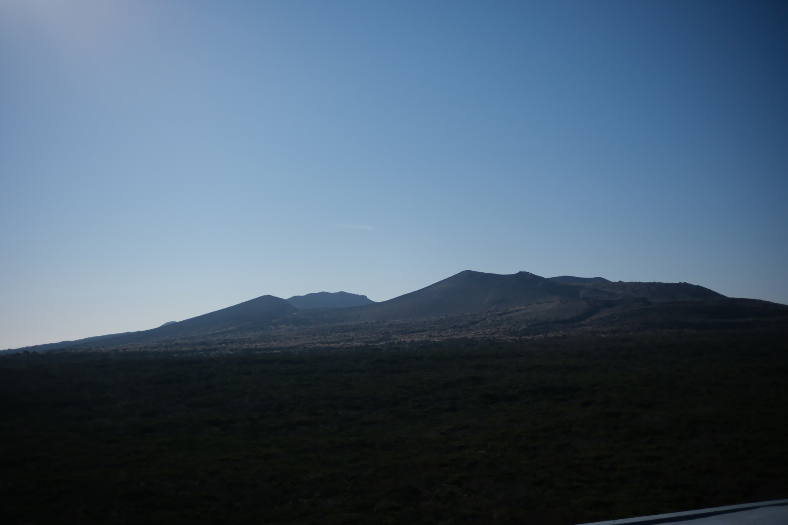
  <figcaption>三原山</figcaption>
</figure>

車で最北端の野田浜に移動した。
赤岩のような岩石が存在するが、浜辺は溶岩流の割合が多かった。

<figure>
  <a href="https://maps.app.goo.gl/YjMxd6G8u1QGkfHy5" target="_blank" rel="noopener noreferrer">
  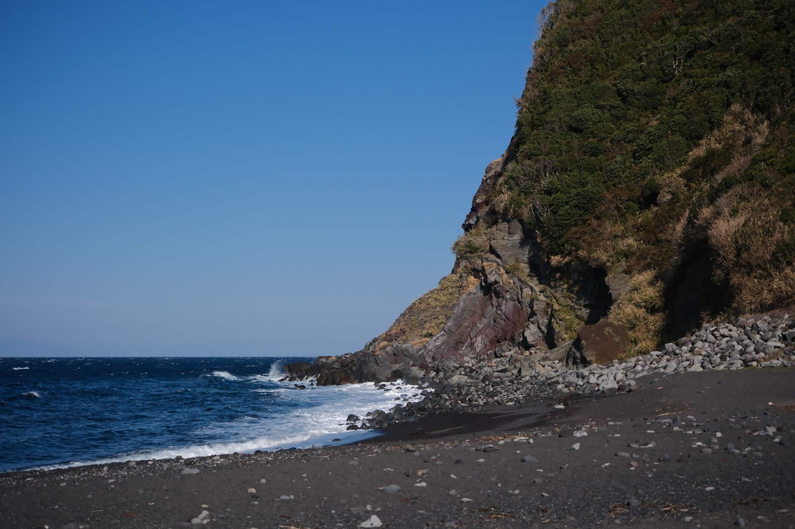
  </a>
  <figcaption>野田浜</figcaption>
</figure>

大島公園動物園ではレッサーパンダ、ラクダ、ラマ、バーバリーシープなどを眺めることができる。
バーバリーシープはおそらく元から存在する溶岩流の近いを活用しており、見応えがあった。

<figure>
  <a href="https://maps.app.goo.gl/MsphwhArPyh65yUz8" target="_blank" rel="noopener noreferrer">
  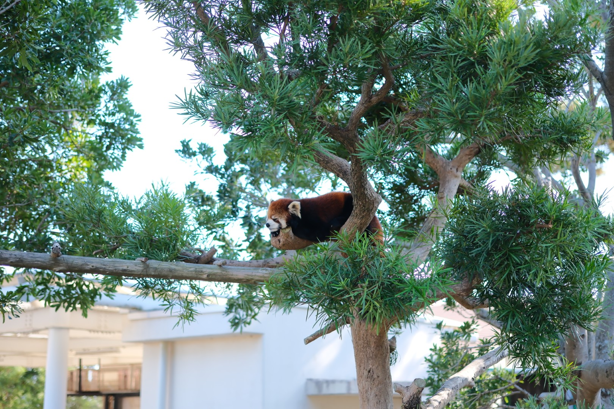
  </a>
  <figcaption>レッサーパンダ</figcaption>
</figure>

出発、そして帰りの地である岡田港にある一峰でべっこう寿司を食べる。
添えられたおそらく明日葉がピリっと辛い味付けになっていてべっこう寿司と合わせて食べると、とっても美味しい。
ワサビではない選択肢。

<figure>
  <a href="https://maps.app.goo.gl/DdfGkpotHTEbzkYR8" target="_blank" rel="noopener noreferrer">
  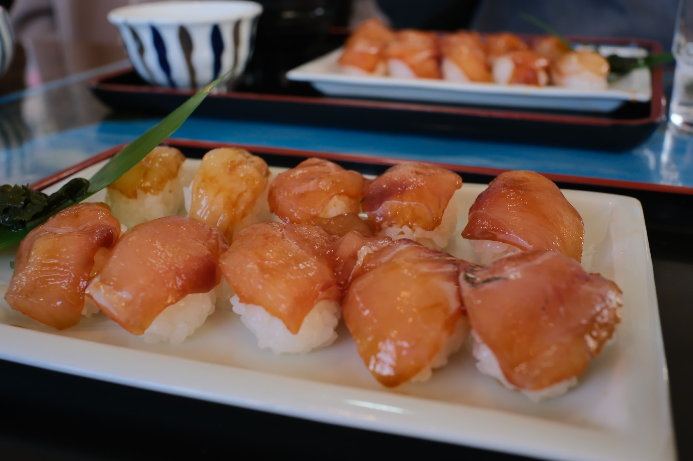
  </a>
  <figcaption>一峰 べっこう寿司</figcaption>
</figure>

ということで帰りの船に乗り込み、暮れに竹芝客船ターミナルに到着した。

撮影機材は
- Fujifilm X-T50
- Fujifilm XF 33mm F1.4 R LW WR
- NOKTON 23mm F1.2 Aspherical

の 2 レンズ構成で臨んだ。
日常では NOKTON 23mm を使うが、AF がないことがありピントが合わせられていないことが多い。
MF は楽しくはあるが、AF は楽であるし大事なシーンを取りこぼさない。
ということで XF 33mm は大活躍した。
しかもこのレンズは写りがとても良く、AF の速度も早いことから良い画が撮れることが多い。

運転に載せてもらい、横から見ていると運転の自由さと楽しさを羨ましく感じたので、時間を見つけて免許を取得したいと思った。
いつの間にか長期休暇期間になっていて、必要な業務に追われていると新学期になってしまうんだよな。

何人かと共に旅行に行くという経験は初めてだったが、全員が判断してスムーズに事が進むので安心感があった。
中高の修学旅行は漠然とした不安があった。
大人になるについて自分が自由に使えるお金が増えたこともあり、何か問題があれば金で殴って解決できるというのは安心感に繋がっているのかもしれない。
また同じメンバーで旅行に行けたら嬉しい。
