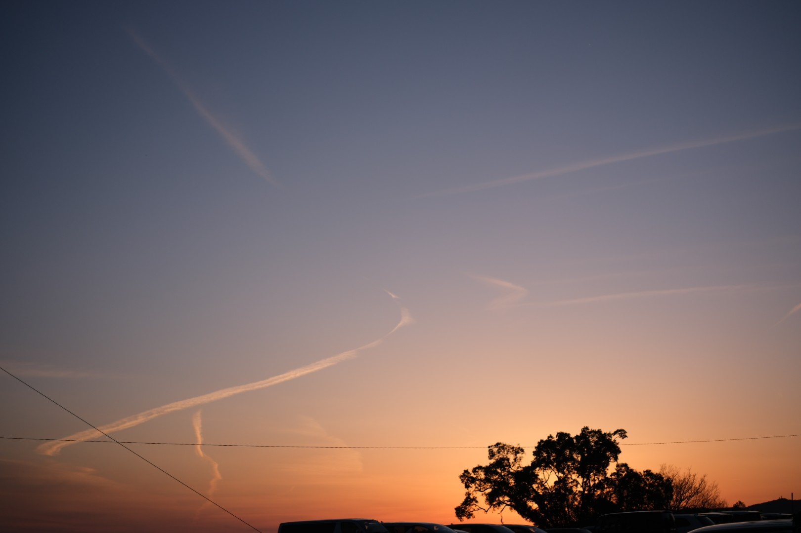
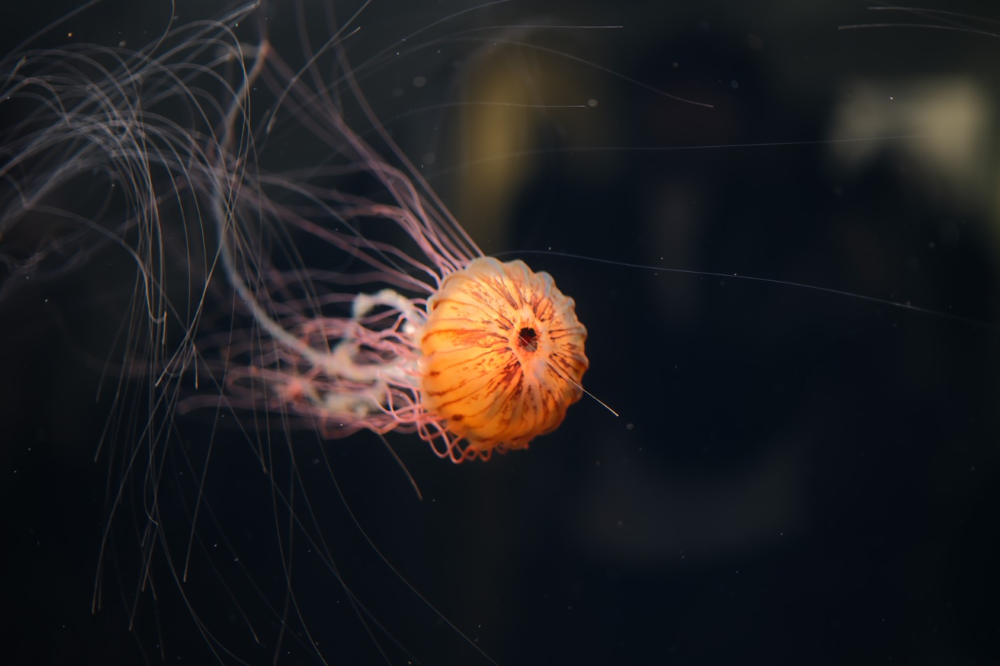

あまり日記というか振り返りを行うことがなく、かつ過去のことはすぐ忘れてしまうため、記録として 2025 年の振り返りを行いたいと思う。

2025 年の 1 月頃は卒論執筆に追われていたが、手は動かずに天井をみながら「つれー、しにてぇ」と悶々としていた記憶がある。
ちなみに、今は風邪でめっちゃダウンして回復した途中だが喉の痛みが全然収まらずに論文の執筆が進まず悶々としている。
取り掛かるのが遅いし、取り掛かってから時間がかかるんだよな。
取り掛かればよいのに、取り掛かれないんだよな。
で、なぜか駄文を書いている。
つれー。
時とまれー。

2025 年 1 月は現実逃避からミラーレスカメラ一眼を購入していた。
やっぱり卒業などで綺麗な写真を記録として残したいという気持ちが強かった。
Fujifilm の X-E4 が好きで E5 の購入を考えていたが、当時は発表されていなかった。
当時でも Fujifilm は品薄の高価格プレミア路線の方向性は見えていたため、多少高くても在庫があってスペックの良いものを買うべきだと考えて X-T50 を購入した。
画素数が高く高精細な写真が取れることに満足している。
せっかく Fuji なのにフィルムシュミレーションを使っていない。
筐体デザインが好きで選んでいる。

2 月、3 月は卒論発表をしたり、学会に行ったり、大学のネットワーク機器の入れ替えをしたり。
学会の出張先の豊橋はマケインで町おこしをしていた。宿泊先は景色もよくてカメラを持っていってよかった。

<figure>
  
  <figcaption>学会の宿泊先のホテルから</figcaption>
</figure>

春からは修士課程にそのまま進学した。
新しいことを始めてみようと、マッチングアプリとカメラサークルに入った。
高いサークル費を払ったものの、1 回しか活動に参加していないし、継続する気はない。
大学 5 年生でサークルに入ったところで肩身が狭かった。
サークル活動の一貫として行った葛西臨海公園の水族館は楽しかった。
マッチングアプリは 3 ヶ月続けた段階で、見ることへの興味が薄れたため退会した。
身近な人では同じコンテクストを共有しているから気楽に話すことができるが、マッチングアプリでは意識外の人とも話す必要があり、話題に困ることは多かった。
世界が広がったので良い経験だった。
美味しいお店を探すのも楽しかった。
ただ、修士かつ浪人している年齢では社会人として立派に労働をして収入を得ている人が多いため、同じ土俵で戦うのは厳しいと感じた。

<figure>
  
  <figcaption>葛西臨海公園のクラゲ</figcaption>
</figure>

夏季休業期間までは夏インターンの応募をしたり、インターンという名のバイトをしたりしていた。
このバイトは 2024 年から断続的に続けており、完全にリモート可、いつ働いてもよい、時給がよい、という最高の環境であり、今もお世話になっている。
任せてもらえる仕事も面白く、非常に良い経験になり、夏インターンの申し込みの話題に悩むことはなかった。
私の就活でのアピールポイントを作ってくれた [CDKTF](https://github.com/hashicorp/terraform-cdk) はアーカイブされてしまい、とても悲しい。
CDKTF は Terraform の HCL をプログラミング言語を用いて生成する DSL であり、HCL では表現しずらい条件分岐などをプログラミング言語を用いて表現することができ、型の支援も受けられる。
欠点としては言語のコンパイルが通ったとしても生成された HCL が正しく実行されるか保証されない点である。
これは Terraform でも同様に HCL が文法的に正しくても実行時にエラーになる。
しかしながら、CDKTF の場合はプログラミング言語上でエラーが発生することがあり 2 重のエラー対応が必要になる。
実行時は生成された HCL を用いるため、実装上のどの部分が問題になっているか突き合わせて確認する必要がある。
DSL としてのよくある欠点である。
ということで、CDKTF は市場で想定よりも普及しなかったと判断されてアーカイブされることになった。
CDKTF を用いてユーザーはおそらく素の Terraform か、Pulumi と呼ばれるプログラミング言語で記述できるツールのどちらかに移行することになるだろう。

夏季休業期間では中学時代を過ごした熊本に旅行して旧友と話した。
旧友に会う以外に目的も計画も定めていなかったため、福岡で彷徨って海まで歩いたり、熊本駅と市街地を散歩するなどしていた。
朝に寝坊しなかったら阿蘇山に行けたのにな。
市街地であか牛のステーキを食べて大満足した。

<figure>
  
  <figcaption>熊本地震後の石垣復旧のための計画がされている</figcaption>
</figure>

夏インターンに参加した。
会社のデータセンターに行き、検証環境を見せてもらうことができた。
期間中に LT 会があって、会社の雰囲気を感じることができた。
よい成果物も残すことができてよかった。

秋学期は [伊豆大島](/post/2025-12-10/izu-oshima/) に旅行した。

クリスマスイブは大学の友人と飲み歩き、人生初のクラブでオールをした。
クラブは音楽爆音で流れていて、ノリノリで踊った。
自分の知らない音楽ばかり流れていたので、自分が知っている曲が流れる DJ イベントに行きたいと思った。
自分自身は東京に住んでいる利便性をあまり感じていなかったのだが、イベントがたくさん開催されていることは利点だと感じた。
タバコの煙が充満していて、帰宅したら全身がタバコ臭くなっていた。
数日後に風邪を引いて、今でも喉が痛い。

2025 年の完走したアニメは下記である。
- Re:ゼロから始める異世界生活 3rd season
- アオのハコ
- ダンジョンに出会いを求めるのは間違っているだろうかⅤ　豊穣の女神篇
- 悪役令嬢転生おじさん
- 沖縄で好きになった子が方言すぎてツラすぎる
- 君のことが大大大大大好きな100人の彼女 第2期
- ギルドの受付嬢ですが、残業は嫌なのでボスをソロ討伐しようと思います
- 薬屋のひとりごと 第2期
- クラスの大嫌いな女子と結婚することになった。
- 全修。
- 花は咲く、修羅の如く
- BanG Dream! Ave Mujica
- メダリスト
- もめんたりー・リリィ
- RINGING FATE
- わたしの幸せな結婚 第二期
- アポカリプスホテル
- ヴィジランテ -僕のヒーローアカデミア ILLEGALS-
- ウマ娘 シンデレラグレイ
- 俺は全てを【パリイ】する～逆勘違いの世界最強は冒険者になりたい～（再放送）
- 機動戦士Gundam GQuuuuuuX
- 小市民シリーズ 第2期
- 男女の友情は成立する？（いや、しないっ!!）
- 日々は過ぎれど飯うまし
- mono
- LAZARUS ラザロ
- ロックは淑女の嗜みでして
- アークナイツ【焔燼曙明/RISE FROM EMBER】
- 薫る花は凛と咲く
- 銀河特急 ミルキー☆サブウェイ
- 公女殿下の家庭教師
- サイレント・ウィッチ　沈黙の魔女の隠しごと
- 青春ブタ野郎はサンタクロースの夢を見ない
- その着せ替え人形は恋をする Season 2
- Turkey!
- タコピーの原罪
- ダンダダン 第2期
- New PANTY ＆ STOCKING with GARTERBELT
- フードコートで、また明日。
- 瑠璃の宝石
- わたしが恋人になれるわけないじゃん、ムリムリ！（※ムリじゃなかった!?）
- ウマ娘 シンデレラグレイ 第2クール
- グノーシア
- 東島丹三郎は仮面ライダーになりたい
- 永久のユウグレ
- 野原ひろし 昼メシの流儀
- 矢野くんの普通の日々
- 私を喰べたい、ひとでなし

他に下記を観た。
- 機動戦士Gundam GQuuuuuuX -Beginning-
- チェンソーマン レゼ篇
- わたしが恋人になれるわけないじゃん、ムリムリ！（※ムリじゃなかった!?）　ネクストシャイン！
- アンデッドアンラック ウィンター編
- 閃光のハサウェイ

この中で気軽にオススメしやすいのは「アオのハコ」「メダリスト」「日々は過ぎれど飯うまし」「薫る花は凛と咲く」「銀河特急 ミルキー☆サブウェイ」あたりだろうか。
「銀河特急 ミルキー☆サブウェイ」は短編であるため 30 分ほどで観ることができる。
毎週公開を心待ちにして視聴できるのは、リアルタイム視聴の醍醐味だった。
ピュアな恋愛ものが好きなので「アオのハコ」「薫る花は凛と咲く」は刺さった。
「クラスの大嫌いな女子と結婚することになった。」は恋愛コメディで一昔の流行を感じさせるが、声優の力量が高く、テンポが良いため何回もリピートしていた。
テンポで言うと「わたしが恋人になれるわけないじゃん、ムリムリ！（※ムリじゃなかった!?）」はセリフ数が多く怒涛の展開である。
めっちゃ面白い。
続編が劇場で先行公開されていて、2 回足を運んだ。
漫画版も小説原作も購入した。
百合作品はまぁまぁの数が出るが、大々ヒットすることは少なく、続編が作られることは珍しいためファンからは続編が期待されている。
「アポカリプスホテル」は話題が重たいかもしれないがぜひ観てほしい。
「小市民シリーズ」は原作が小説で地の文が多いためアニメとして成立させるのが難しいと考えられるが、絵コンテの工夫が良かった。
話の内容はもちろん良い。

就活は一段落し、卒業に必要な講義の単位もあらかた取得したため 2026 年は研究に集中したい。
と思いつつ、冬季休業期間に時間をかけることさえできていないので、先行き不安である。
やはり無理なく計画的に進めるためには意思ではなくてタイムスライスで割り当てて動くべきなんだと思うのだけど、なかなか難しい。
