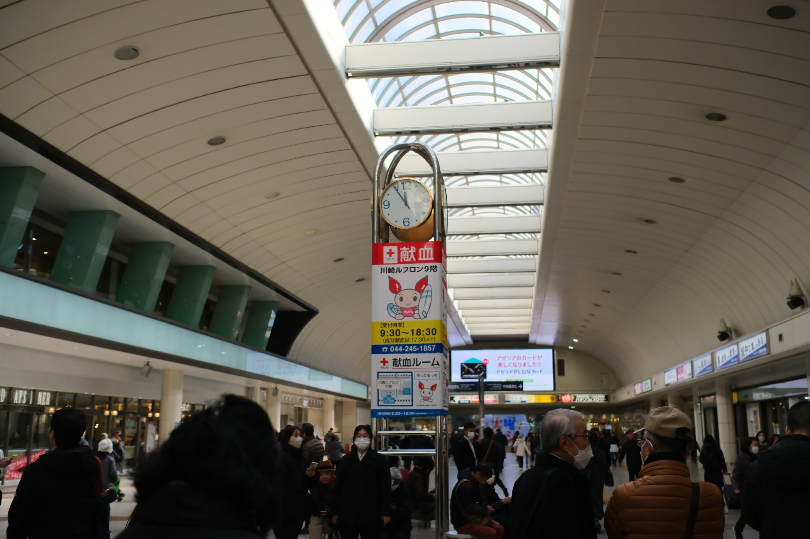
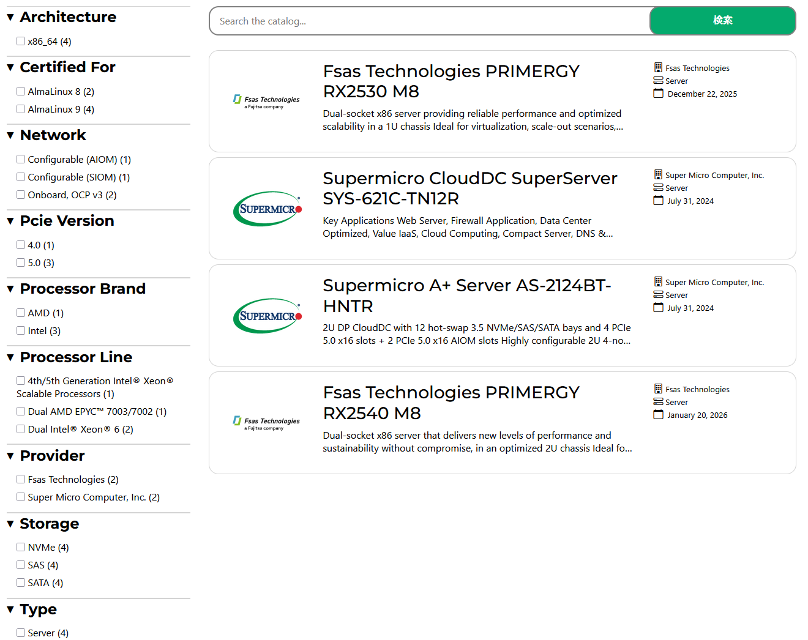

[AlmaLinux Day: Tokyo 2026](https://almalinux.org/ja/almalinux-day-tokyo-2026/) が開催されたので参加した。
2023、2024 に続き、3 回目の開催になる。
2024 の記事は [AlmaLinux Day Tokyo 2024](../2025-02-14/aldt2024/) に書いている。

今回は川崎の Fujitsu Uvance Kawasaki Tower で開催された。
川崎というと「[嘘みたいな 馬鹿みたいな どうしようもない僕らの街](https://youtu.be/YDLafQ-Rg-k)」の歌詞の印象しかなかった。
会場までは綺麗な街並みだった。
都心と比較して超高層ビルが少ないのが良かった。
川崎チネッタという映画館は前から気になっていたので、いつか行ってみたい気持ちが高まった。

<figure>
  
  <figcaption>川崎中央改札</figcaption>
</figure>

# オープンニング
富士通株式会社の 山本 昇平 氏からオープンニングがあった。
ここでの発表として富士通のグループ会社であるエフサステクノロジーズが提供するサーバー PRIMAGY が AlmaLinux ハードウェア認証を取得したことが紹介された。
現時点で世界で 2 番目、日本では初の AlmaLinux 認証取得サーバーになるとのこと。
- AlmaLinux 公式の認証一覧: [Certified Hardware](https://almalinux.org/certification/ecosystem-catalog/)
- 富士通のリリース: [PRIMERGYにおいてAlmaLinux OSハードウェア認証の取得](https://www.fujitsu.com/jp/products/software/os/linux/topics/almalinux-primergy-certification/)

<figure>
  
  <figcaption>Fsas のサーバーが認証一覧に表示されている</figcaption>
</figure>

# AlmaLinux and the Open Source way
AlmaLinux Foundation の Chair である [Benny Vasquez](https://social.linux.pizza/@benny) 氏から

# Benny
Non profit

Alesco: Almalinux engineering steering committee
SIG: Special Interest Group

Sponcer menber: fujitsu, 

Why alalinux

Release: aound the week

TucCare, Cybertrust

ALECso:
Submit an rfc
join the meeting

How can help almalinux

# Andrew
ALESco

OVAL for security scanners

Frame pointers support

Use dynamic workspace indicator on gnome

enable CRB repo by default

Current: Add alternative signed newer kernel

Arista networks EOS

# 西田 有騎 氏(さくらインターネット株式会社)

# 小倉 崇志 氏(株式会社デージーネット)

# a

dcgm
datacenter gpu manager

