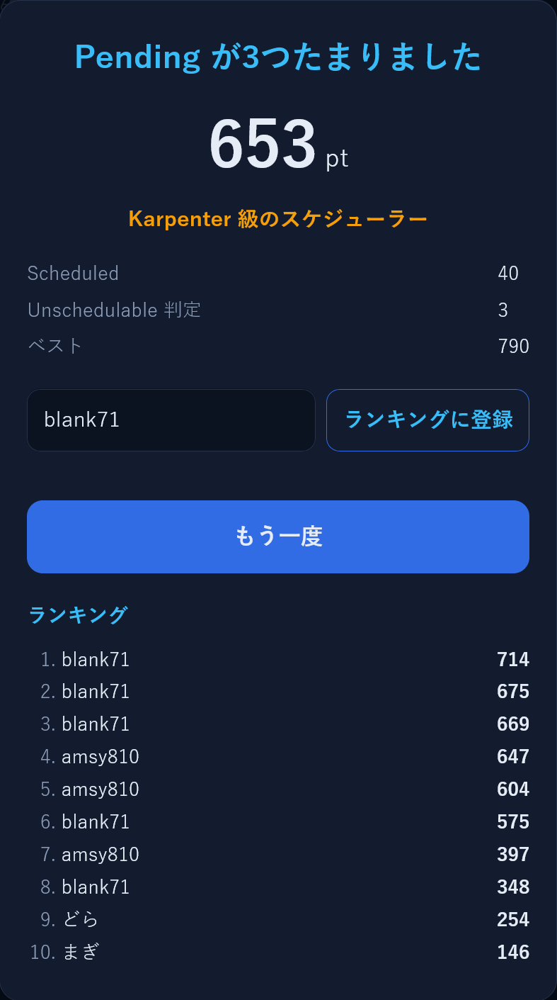

[Platform Engineering Kaigi 2026](https://www.cnia.io/pek2026/) こと PEK2026 に Day スタッフとして参加した。
「当日スタッフの応募が集まっていないよー」的な投稿を Twitter (現 X) で見かけたので折角なら応募してみるかと思い、参加することになった。
イベントスタッフの参加は初めてだった。

8 時に会場集合ということで絶対に寝坊してはいけないと思い、緊張から 4 時に自然起床し、
中野のゼッテリアで朝食と作業を行った。
6 時から営業しており大感謝。

Day スタッフは当日の運営を行うスタッフでメンバーの指示に従って動く。
私は受付を担当で、メンバーの受付担当の Day スタッフの尽力によってトラブルなく業務を行うことができた。
受付は参加者にとって最初に接するスタッフであり、イベントの初印象を左右する重要な役割だと思うので、参加者の方々に気持ちよく参加してもらえるように心がけた。
スタッフの立場になることで見える景色が変わり、今回に関わらずイベント運営に携わるメンバーへの感謝が改めて湧いた。
PEK2026 運営のタスク一覧などを見て、大人数が参加するイベントを開催するには入念な準備とノウハウが必要になるのだと理解した。

受付はシフト制になっており、空いている時間は自由だったのでスポンサーブースでお話を伺った。
セッションを見るだけの体力がなかったので参加できておらず、
動画は後日公開されるので見返したい。
イベント後に日をあけずに無料で動画が公開されるのは素晴らしいことだと思う。

懇親会では様々な知見やアドバイスをもらうことができて、やはり現地参加の醍醐味はこれだなと思った。
地方に住んでいると、イベント開催が少なかったり、現地参加でないと得にくい情報に到達できないという話を聞いて地方でのイベント開催は準備やノウハウ面で難しいよなー、と思った。
私は東京の実家で暮らしているのでふらっとイベント参加できる機会が多くて恵まれているなと思った。

PEK2026 の企画として [Platform City](https://www.cnia.io/pek2026/platform-city/) が存在する。
MCP を使用すると AI を通して Platform City に Web アプリケーションをデプロイすることができる。
街に建物が建設することができる。
私はここで初めて MCP を使用した。
MCP の存在は知っていたが使用したことがなかったため、調べてみて活用できる先がないか考えてみると面白いと思った。
私が気に入ったアプリケーションは [Podテトリス](https://citymap.core.paas.jp/map?b=dora%2Fpod-tetris) で、Pod を適切なノードに配置するゲームになる。
kube-scheduler の気持ちになれて嬉しい。
マイベスト 800 を超えたいがなかなか難しい。

<figure>
  
  <figcaption>Podテトリス</figcaption>
</figure>

Day スタッフとして参加できて良い経験になりました。
ありがとうございました。
